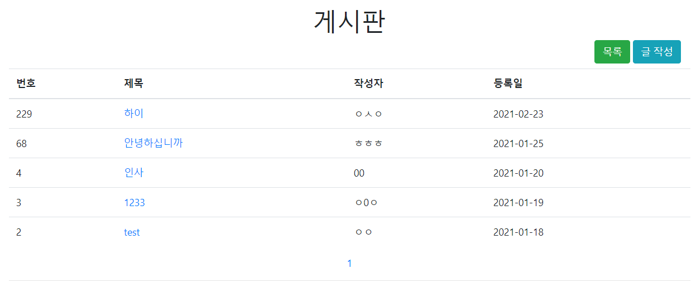
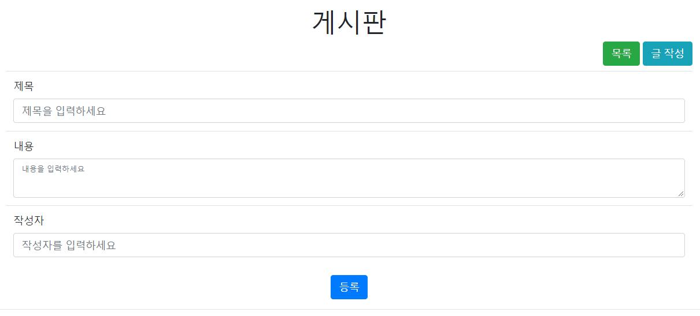
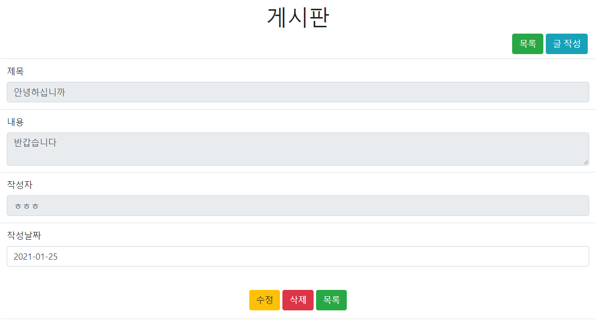
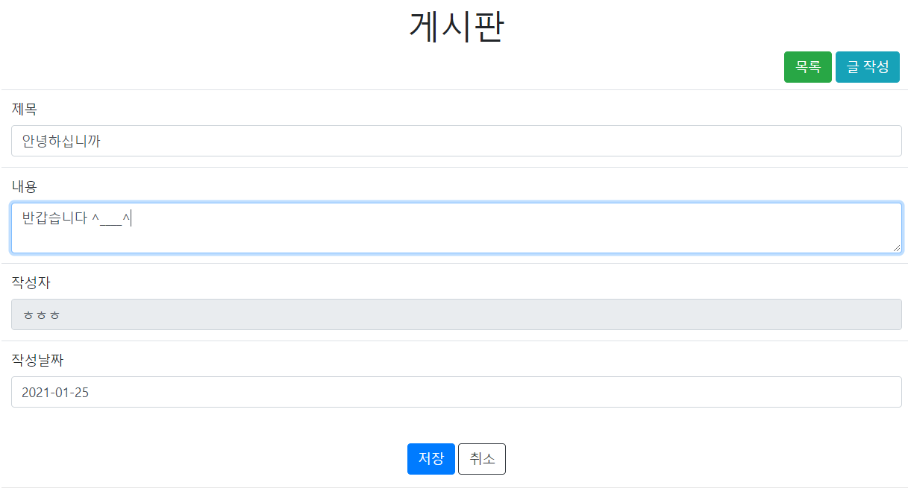
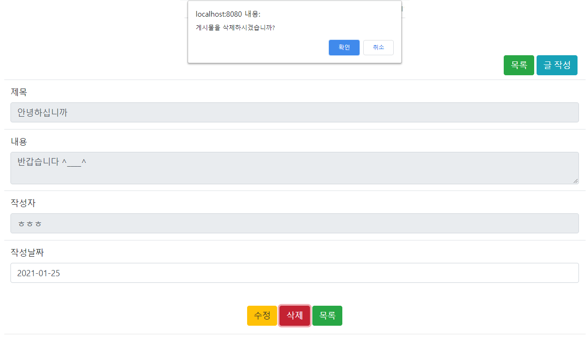

# Board

Springboot 및 JPA 학습을 위해 진행한 개인 프로젝트

### URL
http://shiningjade.me/board

### Stack
Java, Springboot, JPA, H2 Database, Thymeleaf, AWS EC2, AWS RDS

### 프로젝트 환경
- Java 11
- Springboot 2.4.2

### 요구사항(Ver 1.0)
- 게시글 조회
- 게시글 등록
- 게시글 수정
- 게시글 삭제
- 게시글 목록 페이징 구현

### 게시판 구성

- 게시글 목록

- 게시글 등록

- 게시글 조회 

- 게시글 수정

- 게시글 삭제

